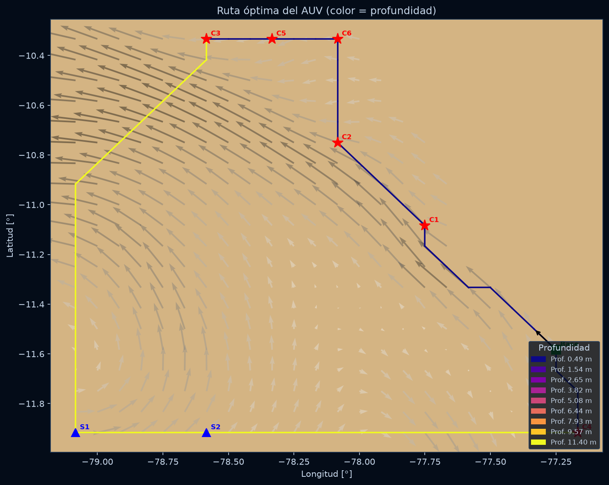
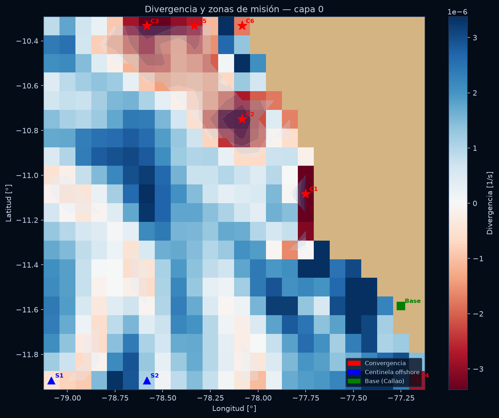
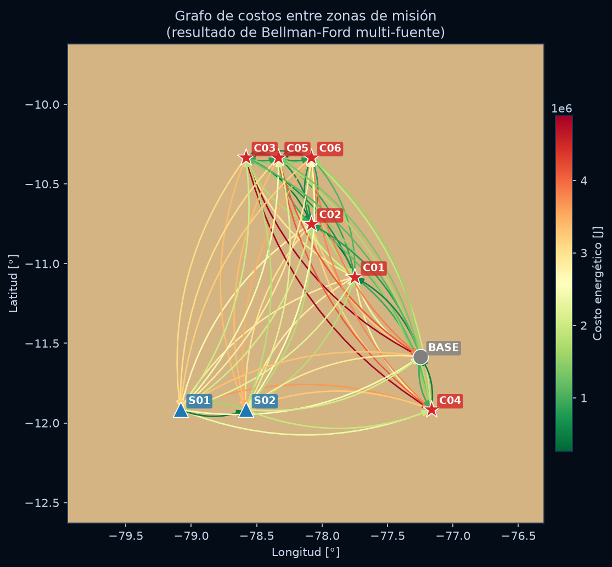
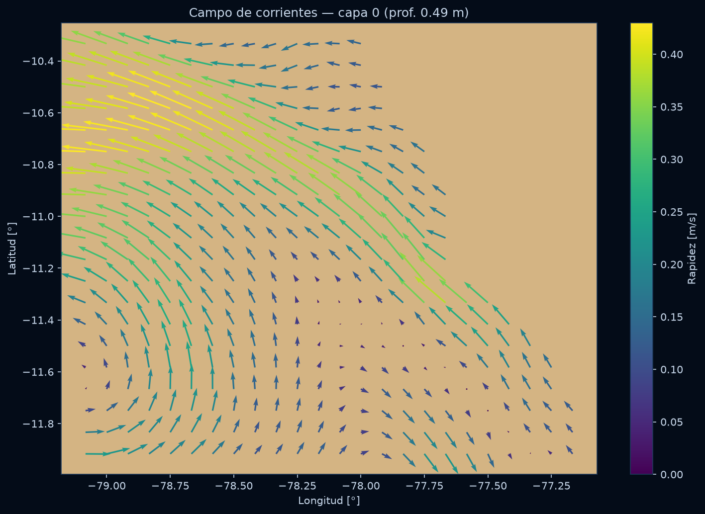
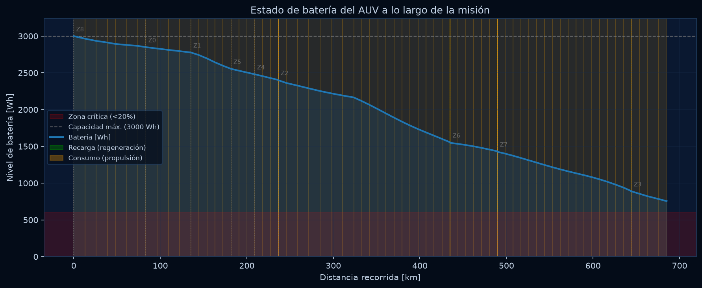

<div align="center">

# 🌊 AUV Route Planner

**Minimum-energy path planning for Autonomous Underwater Vehicles
using ocean current data, Bellman-Ford, and asymmetric TSP.**

[](https://python.org)
[](https://streamlit.io)
[](#testing)
[](LICENSE)

[**Live Demo**](https://auv-rutas.streamlit.app/) · [**Report**](informe/main.pdf)

</div>

---

## What is this?

An AUV (Autonomous Underwater Vehicle) plans a mission along the Peruvian
coast to monitor pollution convergence zones. The system must find the
**minimum-energy route** — because every joule counts when you're underwater
with a finite battery.

The key insight: **ocean currents can both help and hurt**. Moving with a
current regenerates battery (negative edge weight). Moving against it drains
faster. This makes the problem fundamentally different from standard shortest-path.

```
 ┌─────────────────────────────────────────────────────────────┐
 │  Copernicus Marine    →    Directed Graph    →    Optimal   │
 │  NetCDF ocean data        (Bellman-Ford)         Route      │
 │  (uo, vo currents)        with negative          (ATSP)     │
 │                             weights                         │
 └─────────────────────────────────────────────────────────────┘
```

| Route 2D | Mission Zones | Cost Graph |
|:---:|:---:|:---:|
|  |  |  |

| Ocean Currents | Battery Profile |
|:---:|:---:|
|  |  |

---

## How it works

### 1. Ocean data as a graph

The ocean is discretized into a 3D grid (lat × lon × depth). Each navigable
cell is a **node**. Each cell connects to its **26 neighbors** (3D Moore
neighborhood) via directed edges.

The weight of each edge is the **net energy** to traverse it:

```
E_net = E_drag − E_regen + E_gravity

where:
  E_drag    = k_p · ‖v_r‖³ · Δt       (NASA drag equation)
  E_regen   = k_r · η · ‖v_c‖³ · Δt   (turbine regeneration)
  E_gravity = m · g · |Δz| / η          (vertical movement)
  v_r       = s·ê − v_c                 (velocity relative to water)
```

When the current pushes the AUV forward, `E_regen > E_drag` → **negative
weight**. This is where Bellman-Ford beats Dijkstra.

### 2. Mission zone selection

Zones aren't picked manually. They're derived from the **horizontal divergence**
of the current field:

```
div = ∂uo/∂x + ∂vo/∂y
```

Where `div < 0`, flow converges — pollutants accumulate there. The top-k
convergence cells become **waypoints**. Additional **sentinel cells** are placed
offshore for early spill detection.

### 3. Optimal route (Bellman-Ford + ATSP)

- **Bellman-Ford** finds the minimum-energy path between every pair of zones
  (handles negative weights from regeneration).
- The resulting cost matrix feeds an **Asymmetric Traveling Salesman Problem**
  solver (exact enumeration) to find the optimal visit order.
- A negative cycle detector validates the model before solving.

---

## Features

- **Interactive 6-phase workflow**: Data → Currents → Zones → Graph → ATSP → Mission
- **6 AUV presets**: REMUS 100, REMUS 600, REMUS 620, Bluefin-9, Generic, Test
- **8 Peruvian port bases** pre-configured + custom base support
- **Custom NetCDF upload** with automatic CMEMS variable detection
- **Real-time parameter tuning**: speed, efficiency, drag coefficients, battery
- **Algorithm comparison**: Bellman-Ford vs Dijkstra/A* (shows regeneration advantage)
- **3D interactive visualization** with Plotly (graph edges colored by energy sign)
- **Export**: CSV, PNG, JSON route data
- **Dark maritime theme** with industrial UI design

---

## Architecture

```
rutas-auv/
├── src/                        # Core (zero Streamlit dependency)
│   ├── config.py               # ParametrosModelo — frozen dataclass
│   ├── datos.py                # NetCDF loader + CMEMS alias resolution
│   ├── grafo.py                # Directed graph + energy cost function
│   ├── zonas.py                # Divergence, waypoint & sentinel selection
│   ├── algoritmos.py           # Bellman-Ford, cost matrix, ATSP solver
│   ├── metricas.py             # Battery simulation + CSV export
│   └── visualizacion.py        # Matplotlib + Plotly plots (framework-agnostic)
├── app.py                      # Streamlit UI (presentation layer)
├── data/                       # NetCDF datasets (CMEMS)
├── tests/                      # 42 unit tests
├── informe/                    # Technical report (Typst → PDF)
└── assets/                     # Drone images
```

**Dependency rule**: `src/` never imports from `app.py`. The core is
framework-agnostic — the UI could be swapped for Flask, FastAPI, or a CLI
without touching the algorithms.

---

## Tech stack

| Layer | Technology |
|---|---|
| Algorithms | Python, NumPy, itertools |
| Data | xarray, NetCDF4 (Copernicus Marine CMEMS) |
| Visualization | Matplotlib (2D), Plotly (3D interactive) |
| UI | Streamlit ≥ 1.45 |
| Testing | pytest |
| Report | Typst |

---

## Quick start

```bash
# Clone
git clone https://github.com/axismf/auv-optimization.git
cd rutas-auv

# Install
pip install -r requirements.txt

# Run
streamlit run app.py

# Test
pytest
```

The app loads a sample dataset (`data/Lima-New.nc`) automatically.
You can also upload your own NetCDF from Copernicus Marine.

---

## Testing

```bash
$ pytest

..........................................                    [100%]
42 passed in 1.36s
```

Tests cover: Bellman-Ford correctness, negative cycle detection, ATSP
optimality, graph construction, cost function, waypoint selection, battery
simulation, and metric computation.

---

## Background

This project was developed as part of an undergraduate thesis on AUV mission
planning for environmental monitoring along the Peruvian coast. The energy
model is based on:

- **NASA Drag Equation** for hydrodynamic resistance
- **Turbine regeneration** model (Sun et al., 2022)
- **Horizontal divergence** for pollution convergence detection
- **Bellman-Ford** for shortest paths with negative weights
- **Exact ATSP enumeration** for optimal visit sequencing

---

<div align="center">

**Built with Python** 🐍

</div>
